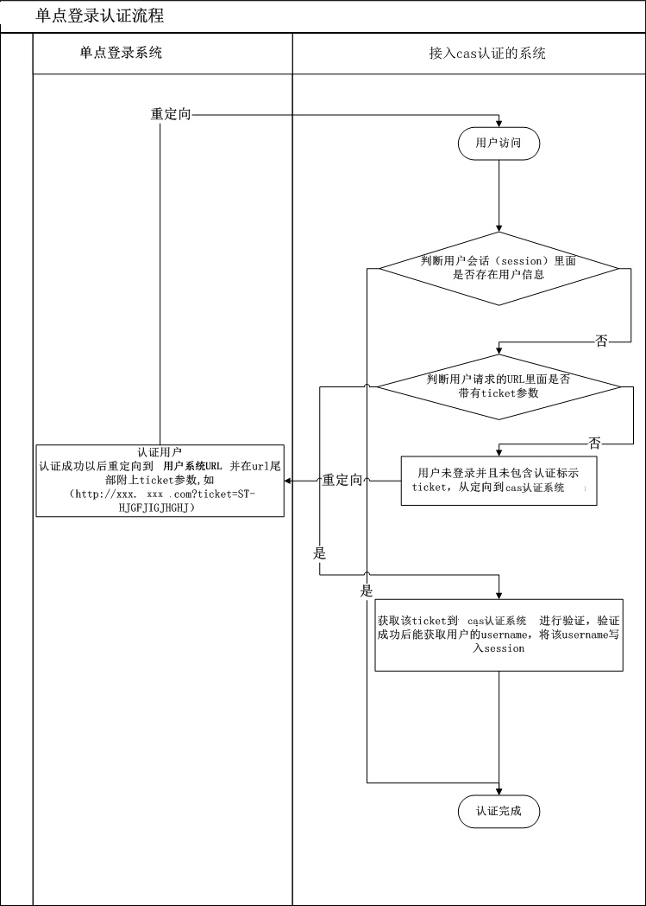

node cas认证单点登录demo
====

## 原理介绍

[单点登录百科](http://baike.baidu.com/view/993620.htm)

[cas协议](https://github.com/Jasig/cas)

对于使用标准cas的认证系统，可以使用任何一种语言来实现认证过程。如php的cas认证库 https://github.com/Jasig/phpCAS

## demo说明

本demo主要代码为lib/cas.js中间件

通过使用express的中间件拦截请求，根据session判断是否有用户名，如果没有则进入cas认证流程。
认证流程分为两个主要步骤：

一是跳转到cas登录页面，获取登录成功后返回的ticket参数。如果已登录则会直接跳转回并携带ticket参数
二根据ticket参数通过cas认证接口认证，获取用户名信息，并保存到session中

中间件可以拦截所有请求，进行登录验证之后再使用`next()`进入下一步处理。如果登录失败可以添加失败处理逻辑。

## 单点登录验证流程

